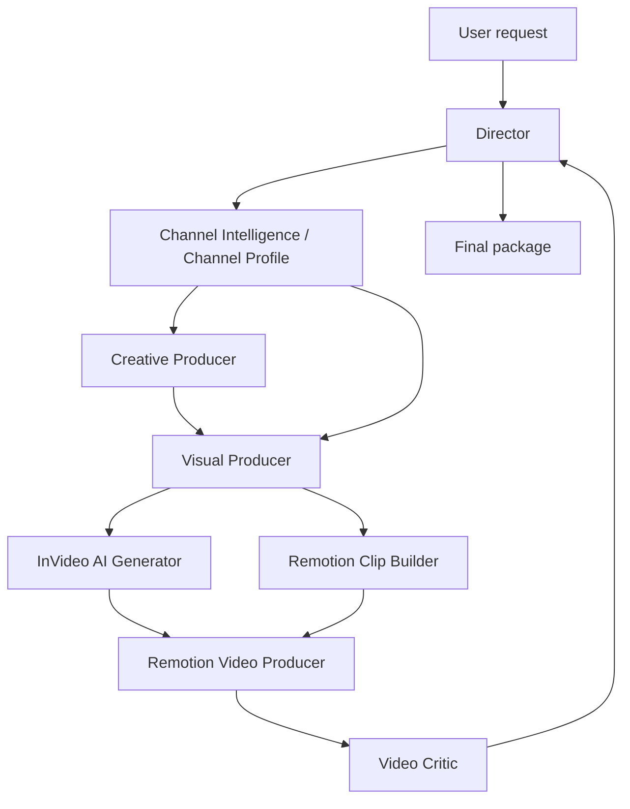

# Research Synthesis: Video Factory Agent Architecture

## Real-World Evidence

Professional video work clusters around phases, not dozens of micro-roles. McGill's video production process describes most projects as pre-production, production, and post-production: pre-production covers request, scope, budget, scripting/storyboarding, and planning; production records video and creates assets such as graphics, animation, and voiceover; post-production brings the elements together with editing, color, titling, audio, music, formatting, captions, and media management. Source: https://www.mcgill.ca/video-production/process

Adobe's video production guide matches this pattern. It describes video production as concept development, scripts, storyboarding, shooting, troubleshooting, editing, and graphics. It also shows that a producer/director starts the project, writers and visual leads collaborate on script/storyboard, and smaller crews often capture B-roll, voiceover, and sound effects. Source: https://www.adobe.com/creativecloud/video/production.html

Adobe's post-production guide lists specialized post roles such as editor, sound, VFX, colorist, and graphics, but also notes that advertising editors often wear more hats because of budget. That supports a compact architecture, but the current Remotion scan found one necessary split: reusable Remotion clip/VFX generation should be separate from full timeline assembly and render QA. Source: https://www.adobe.com/creativecloud/video/post-production

LangChain DeepAgents documents subagents as useful for context isolation and specialized instructions, but explicitly warns not to use them for simple single-step tasks or when the overhead outweighs the benefit. Source: https://docs.langchain.com/oss/python/deepagents/subagents

OpenAI describes Codex as a coding agent that can read, edit, and run code through CLI and CI/CD workflows. Codex also exposes an experimental MCP server interface for threads, turns, config, approvals, and event streams. This supports a future architecture where another orchestrator calls Codex workers, but Codex should remain the execution engine for coding and Remotion work. Sources: https://developers.openai.com/api/docs/guides/code-generation and https://github.com/openai/codex/blob/main/codex-rs/docs/codex_mcp_interface.md

Remotion is the right deterministic video implementation target because it creates real MP4 videos with React, supports browser preview, frame-level timeline work, and programmatic rendering. Source: https://www.remotion.dev/

Independent final review should be separate from production. Video teams commonly separate producing/editing from review/approval, and multimodal model critique benefits from a clean context that judges the final viewer experience instead of defending production choices.

## Handoff And Boundary Findings

Current multi-agent guidance supports a supervisor/worker boundary for this project. LangChain describes subagents as a pattern where a central main agent or supervisor decides which subagent to invoke, what input to provide, and how to combine the results; it also calls out context isolation as a main benefit. Source: https://docs.langchain.com/oss/python/langchain/multi-agent/subagents

LangChain's supervisor tutorial recommends clear domain boundaries, focused prompts/tools per worker, clear descriptions for the supervisor, independent layer testing, and deliberate control over information flow. Source: https://docs.langchain.com/oss/python/langchain/multi-agent/subagents-personal-assistant

OpenAI's Agents SDK represents handoffs as explicit delegation to another specialist agent and supports custom handoff input schemas plus input filtering. This maps well to the local `agent-handoff` contract: the Director should preserve state and route structured inputs instead of allowing a specialist to execute another specialist's skills directly. Source: https://openai.github.io/openai-agents-python/handoffs/

Anthropic's agent workflow guidance supports routing when distinct categories need specialized prompts, orchestrator-workers when a central model dynamically delegates subtasks, and evaluator-optimizer loops when clear criteria can improve later iterations. This reinforces the Director-managed routing model and the separate Video Critic loop. Source: https://www.anthropic.com/engineering/building-effective-agents

Local decision: production agents call only local skills and approved built-in skills. Cross-agent work is expressed as a handoff recommendation, then the Director creates the actual `agent-handoff` with target agent, inputs, allowed paths, output contract, budget policy, and definition of done. This keeps ownership clear, prevents context bleed, and makes run-ledger state easier to audit.

## Project Workspace And Artifact Findings

LangChain Deep Agents is relevant as a comparable architecture because it treats planning, subagents, filesystem tools, persistent memory, filesystem permissions, and human-in-the-loop controls as harness capabilities rather than prompt-only conventions. This supports the local choice to put durable channel/project/run state in inspectable files and folders. Source: https://docs.langchain.com/oss/python/deepagents/overview

LangChain's subagent guidance says subagents are useful for context isolation and specialized instructions, but not for simple single-step work or cases where overhead outweighs the benefit. That supports a small set of broad production-role agents and project folders that carry state between them. Source: https://docs.langchain.com/oss/python/deepagents/subagents

OpenAI's Agents SDK represents handoffs as explicit delegation to another specialist agent and supports custom handoff input schemas. That maps directly to the local `agent-handoff` schema and argues for typed artifact paths, allowed paths, and output contracts instead of informal prompt handoffs. Source: https://openai.github.io/openai-agents-python/handoffs/

Codex's own public guidance emphasizes configured environments, repository instructions, testing commands, and evidence such as terminal logs and test outputs. That supports adding a concrete `remotion/` app plus contracts for Remotion setup and media artifacts instead of keeping the render environment implicit. Source: https://openai.com/index/introducing-codex/

Local decision: channel folders are durable identity and reference state; project folders are durable deliverable workspaces; run folders are execution attempts. Loaded videos, source media, generated clips, rendered clips, subtitles, review frames, and evidence refs are tracked by `media-asset-manifest.schema.json`. The Remotion app is tracked separately by `remotion-project.schema.json` so dependencies, commands, composition ids, and public asset rules are explicit.

## Context Compaction Findings

LangChain's current context-engineering guidance for deep agents separates input context, runtime context, and context compression. It recommends offloading large tool inputs/results to a filesystem, summarizing older messages, using subagents for context quarantine, and keeping active context small by reading files back only when needed. Source: https://docs.langchain.com/oss/python/deepagents/context-engineering

LangChain's short-term memory docs describe long conversations as costly and error-prone even when a model technically supports the context length; common mitigations include trimming, deleting, summarizing, and custom message filtering. For this project, destructive deletion is a bad fit because the Director needs auditability, but summarizing plus artifact references maps well to the run ledger. Source: https://docs.langchain.com/oss/python/langchain/short-term-memory

Letta's compaction docs describe sliding-window summarization, keeping recent messages while summarizing older ones, and configurable compaction modes. Letta's stateful-agent docs also emphasize that old messages remain retrievable after compaction/eviction while important memory is injected back into context. This supports preserving raw records on disk and keeping only compact working memory in the active prompt. Sources: https://docs.letta.com/guides/core-concepts/messages/compaction/ and https://docs.letta.com/guides/core-concepts/stateful-agents

The MemGPT paper frames context management as hierarchical memory: move information between fast limited context and slower larger storage while preserving the illusion of a larger working memory. The local equivalent is `production-run.context_state` as fast memory and project/run artifacts as slower authoritative storage. Source: https://arxiv.org/abs/2310.08560

Local decision: add a Director-owned `context-compaction` skill, not a script. Compaction needs judgment about what is authoritative, stale, blocked, or required next. The skill updates `production-run.context_state`, optionally writes run-local context snapshots, and forces resumes to reload only the next working set rather than the whole conversation.

## Remotion Capability Findings

The installed Codex Remotion skill is not just a generic style guide. It includes local rules for 3D, animation, assets, audio, audio visualization, captions/subtitles, FFmpeg, GIFs, light leaks, Lottie, maps, text animations, transitions, transparent videos, trimming, videos, and voiceover.

Current Remotion docs support a broad post-production stack:

- Remotion's current project setup starts with `npx create-video@latest`, then Studio and CLI rendering; that justifies a real shared `remotion/` app in this repo rather than purely abstract render prompts. Source: https://www.remotion.dev/docs
- Remotion resolves local render assets through `staticFile()` from the app's `public/` folder; the `public/` folder must sit beside the Remotion `package.json`. This justifies the project media manifest plus Remotion public projection rule. Source: https://www.remotion.dev/docs/staticfile
- Remotion's `<Artifact>` can emit sidecar files during rendering, including thumbnails, which supports treating subtitle files, metadata, thumbnails, QA reports, and review frames as first-class artifacts. Source: https://www.remotion.dev/docs/artifact
- Captions can be imported from `.srt`, transcribed from audio, displayed as timed caption pages, and exported as burned-in subtitles or separate `.srt` artifacts. Source: https://www.remotion.dev/docs/captions
- Remotion caption transcription can use local Whisper.cpp, browser Whisper, OpenAI Whisper, or ElevenLabs Speech to Text, and all routes can normalize to Remotion's `Caption` type for downstream caption utilities. Source: https://www.remotion.dev/docs/captions/transcribing
- Caption display uses `Caption[]` JSON, `createTikTokStyleCaptions()`, and `<Sequence>` frame ranges, which makes caption timing a first-class timeline input rather than an afterthought. Source: https://www.remotion.dev/docs/captions/displaying
- `@remotion/transitions` provides `TransitionSeries`, timing presets, and presentations such as fade, slide, wipe, flip, clock wipe, iris, zoom blur, and overlay transitions. Source: https://www.remotion.dev/docs/transitions
- `@remotion/light-leaks` provides a WebGL light leak component that can also be used as a transition overlay. Source: https://www.remotion.dev/docs/light-leaks
- `@remotion/three` integrates React Three Fiber through `ThreeCanvas`, video textures, and server-side OpenGL guidance. Source: https://www.remotion.dev/docs/three
- `@remotion/lottie` displays Lottie animations inside Remotion. Source: https://www.remotion.dev/docs/lottie
- `@remotion/media-utils` supports audio metadata, duration, waveform extraction, and audio visualization helpers. Source: https://www.remotion.dev/docs/media-utils
- `@remotion/motion-blur`, `@remotion/noise`, and `@remotion/shapes` provide MIT-licensed utilities for motion blur/trails, procedural noise, and SVG shapes. Sources: https://www.remotion.dev/docs/motion-blur, https://www.remotion.dev/docs/noise, https://www.remotion.dev/docs/shapes
- Remotion can render through Studio, CLI, server-side rendering, Lambda, GitHub Actions, and Cloud Run; it supports MP4, WebM, AV1, ProRes, GIF, image sequences, stills, and transparent video workflows. Sources: https://www.remotion.dev/docs/render, https://www.remotion.dev/docs/miscellaneous/video-formats, https://www.remotion.dev/docs/transparent-videos
- Mediabunny is now the recommended multimedia helper direction for metadata/frame/media work and is MPL 2.0. Source: https://www.remotion.dev/docs/mediabunny

Use Remotion-native templates and packages before considering generic web libraries. Official free Remotion templates include Blank, Hello World, Next.js variants, Recorder, JavaScript, Render Server, Electron, React Router, 3D, Stills, Audiogram, Music Visualization, Prompt to Video, Skia, Overlay, Code Hike, Stargazer, and TikTok. Paid Remotion Pro templates such as Editor Starter, Watercolor Map, and Timeline require explicit Director approval. Source: https://www.remotion.dev/templates

Remotion's Prompt to Motion Graphics SaaS starter is useful as a workflow reference for text-to-motion generation. It includes conversation history, live Remotion Player preview, smart targeted edits versus full replacement, input validation, output sanitation, and compile-error self-correction. The docs also distinguish the SaaS template from Agent Skills: use the template for building a SaaS, but use Agent Skills when prompting videos for yourself. This project follows the Agent Skills/Codex route and borrows the validation and self-correction loop. Source: https://www.remotion.dev/docs/ai/ai-saas-template

Remotion's AI system prompt emphasizes a few rules worth preserving in local Codex prompts: TypeScript React output, named components/compositions, `useCurrentFrame()`, `useVideoConfig()`, `Sequence`, `Series`, `TransitionSeries`, `interpolate()`, `spring()`, deterministic `random(seed)` instead of `Math.random()`, `staticFile()` for local assets, and render/still commands for validation. Source: https://www.remotion.dev/docs/ai/system-prompt

The RemotionTemplates animation intro reinforced the same low-level primitives: frame-aware animation with `useCurrentFrame()`, `useVideoConfig()`, `interpolate()`, `spring()`, and full-frame layout via `AbsoluteFill`. It also shows AI-assisted generation as useful for Remotion animation code, but the output still needs a local validation loop. Source: https://remotiontemplates.dev/articles/remotion-animations-intro

Remotion-native component/package choices should be preferred over generic HTML component libraries:

- `@remotion/animated-emoji` wraps Google Fonts Animated Emoji into Remotion components, with emoji assets under CC BY 4.0. Source: https://www.remotion.dev/docs/animated-emoji
- `@remotion/rive` renders local Rive animations in Remotion. Source: https://www.remotion.dev/docs/rive
- `@remotion/skia` integrates React Native Skia and has a Skia starter template. Source: https://www.remotion.dev/docs/skia
- `@remotion/rounded-text-box` creates TikTok-like rounded multiline text-box SVG paths and is MIT licensed. Source: https://www.remotion.dev/docs/rounded-text-box
- `@remotion/paths` provides dependency-free SVG path utilities and is MIT licensed. Source: https://www.remotion.dev/docs/paths
- `@remotion/starburst` provides a WebGL retro starburst ray component. Source: https://www.remotion.dev/docs/starburst

## InVideo AI Generation Findings

InVideo Agent One is a conversational AI filmmaker that builds a video scene by scene and edits through a back-and-forth creative process. That makes it useful for InVideo-managed generation, but it still needs explicit local contracts so Codex can preserve prompts, approvals, outputs, and QA. Source: https://help.invideo.io/en/articles/14717491-getting-started-with-agent-one

InVideo Prompt Guides are standing instructions for model behavior. InVideo ships default guides for Nano Banana, Veo, Sora, Kling, and ElevenLabs Voice Design, and custom guides can hold repeated style, camera, lighting, voice, character, or brand constraints. Source: https://help.invideo.io/en/articles/14718640-prompt-guides-what-they-are-and-how-to-set-them-up

InVideo generation is credit-sensitive. Agent One can generate images, video clips, voices, and other media in one exchange; InVideo recommends approval controls because the generation dialog can show the prompt, model, duration, and aspect ratio before spending credits. Source: https://help.invideo.io/en/articles/14718313-how-credits-are-charged-in-agent-one

InVideo quality modes map to different production needs: Basic uses stock media, Pro generates every pixel with more realistic motion, and Ultra uses flagship models for the highest realism and product/brand integration at higher credit cost. Source: https://help.invideo.io/en/articles/12680004-basic-pro-and-ultra-choosing-your-generation-quality

InVideo's current model pages support a dedicated AI generation agent rather than burying the work inside Visual Producer. Sora 2 Pro is described for 4-12 second clips, Veo 3.1 for 4-8 second high-fidelity cinematic clips with a seven-layer prompt formula, and Kling 3.0 for 3-15 second clips with native audio, multi-shot sequencing, multi-character consistency, and lip sync. Sources: https://help.invideo.io/en/articles/12542423-creating-with-sora-2-in-invideo, https://help.invideo.io/en/articles/14756020-creating-with-veo-3-1, and https://help.invideo.io/en/articles/14756468-creating-with-kling-3-0

General AI-video prompt evidence is not uniform about negative prompts. Google's Veo prompt guide supports negative prompts but recommends listing unwanted elements rather than writing commands like "no" or "don't"; Runway's Gen-4 guide recommends positive phrasing and warns that negative phrasing may behave unpredictably. The local contract therefore records both negative constraints and the mode used: separate negative field, converted positive constraint, prompt guide, unsupported, or unused. Sources: https://docs.cloud.google.com/vertex-ai/generative-ai/docs/video/video-gen-prompt-guide and https://help.runwayml.com/hc/en-us/articles/39789879462419-Gen-4-Video-Prompting-Guide

## ElevenLabs Voiceover Findings

ElevenLabs should be a provider skill inside Creative Producer, not a separate agent. Voice casting is a pre-production creative decision, but actual provider inventory and paid generation need deterministic scripts and approval gates.

Current ElevenLabs docs support two concrete integration points:

- `GET /v2/voices` lists available voices with search, pagination, voice type, category, labels, preview URLs, and settings metadata. This enables real voice selection from the user's account instead of imaginary voice descriptions. Source: https://elevenlabs.io/docs/api-reference/voices/search
- `POST /v1/text-to-speech/:voice_id/with-timestamps` generates speech and returns audio plus character-level original and normalized alignment data. That is the right route when Remotion subtitles and visual timing should sync to generated narration. Source: https://elevenlabs.io/docs/api-reference/text-to-speech/convert-with-timestamps

The local design therefore adds `voiceover-package.schema.json`, guarded ElevenLabs scripts, and a Remotion `timeline-sync-plan` contract. Paid generation remains blocked until the Director records approval, but voice selection and dry-run payload preparation can happen before spend.

## Multimodal Critique Findings

The Video Critic is an independent validation agent, not a new production department. It exists because a final rendered video should be judged against the viewer experience, source/story intent, channel rules, and delivery artifacts by a different context than the one that built it.

Current OpenRouter docs support video inputs through `/api/v1/chat/completions` using `video_url` with public URLs or base64 data URLs, and the model metadata for `qwen/qwen3.6-plus` exposes text, image, and video input with text output. Qwen's own visual-understanding docs recommend `qwen3.6-plus` for image/video understanding, list a 1M context window, and document 2-hour / 2GB video support. Therefore hybrid critique is now the preferred route when Director approval, provider limits, and media policy allow it: direct video for temporal understanding, sampled frame stills for sharp text/caption/safe-area checks, and transcript/captions plus production artifacts for audio/story/source evidence. Sources: https://openrouter.ai/docs/guides/overview/multimodal/videos, https://openrouter.ai/qwen/qwen3.6-plus, and https://docs.qwencloud.com/developer-guides/getting-started/vision-models

The model call is approval-gated because image inputs are billed and may involve sensitive media. The same agent can still run artifact-only critique without spend.

The review loop follows the evaluator-optimizer pattern: production agents generate a render, Video Critic evaluates it against explicit criteria, Director routes the structured feedback back to the owning agents, and the cycle repeats until gates pass or a stop condition is hit. Anthropic and LangGraph both describe this pattern as useful when evaluation criteria are clear and feedback can improve the next attempt. Sources: https://www.anthropic.com/engineering/building-effective-agents and https://docs.langchain.com/oss/python/langgraph/workflows-agents

The loop also needs guardrails. Self-Refine and Reflexion show that natural-language feedback can improve future attempts, but reward-hacking research shows iterative self-refinement can optimize an imperfect evaluator while real quality stagnates or drops. This project mitigates that by keeping the critic separate from producers, recording every critique report, requiring scene-by-scene evidence, using hard gates, limiting iterations, and stopping on repeated blockers. Sources: https://arxiv.org/abs/2303.17651, https://arxiv.org/abs/2303.11366, and https://arxiv.org/abs/2407.04549

## Channel Intelligence Findings

The Visual Producer should not own deep channel/reference analysis. Reference-video analysis, web-source synthesis, channel style rules, persistent channel folders, and anti-redundancy checks affect scenario writing, voice selection, visual planning, AI generation prompts, Remotion clips, and final editing. That makes them an upstream channel intelligence responsibility rather than a scene-level visual production task.

YouTube's channel branding guidance frames a channel brand as a recognizable message, values, community, and consistent visual identity, not just isolated clip choices. Source: https://support.google.com/youtube/answer/12950272

YouTube's channel branding docs track concrete reusable platform assets: profile picture, banner, and video watermark, with banner safe-area and watermark constraints. Source: https://support.google.com/youtube/answer/10456525

YouTube's channel layout docs show persistent channel management beyond video production: home tab, channel trailer, featured video, and channel sections. Source: https://support.google.com/youtube/answer/3219384

Public brand systems such as Purdue's include strategy, messaging, visual identity, voice/tone, logos, templates, photography, video, editorial style, and analytics resources. This supports storing channel defaults as a profile folder rather than embedding all brand state in one production prompt. Source: https://marcom.purdue.edu/our-brand/

Hunter's voice/tone guidance shows that brand voice encodes domain posture and personality constraints, not only writing style. This maps to the local voice inheritance rule: channel profile audio identity guides Creative Producer before provider voice selection. Source: https://www.hunter.com/en-int/media-center/brand-guidelines/voice--tone/

YouTube's creator playbook for brands uses a content strategy split of hero, hub, and hygiene content. That maps well to a reusable channel format package: major tent-pole videos, recurring episode formats, and always-on search/utility videos should share a channel language while serving different jobs. Source: https://think.storage.googleapis.com/docs/creator-playbook-for-brands_research-studies.pdf

YouTube monetization guidance emphasizes original, authentic, non-repetitive content. It also notes that reviewers may look across a channel's main theme, most viewed videos, newest videos, major watch-time sources, metadata, and About section. This supports adding an explicit redundancy-risk audit before production. Source: https://support.google.com/youtube/answer/1311392

Reference-analysis tools show the same workflow boundary in practice. VidRush separates reference-video transcript rhythm from visual style decisions; ShotBook breaks references into technique, structure, camera, editing, and execution; Video to Prompt turns reference clips into shot-level prompts with camera, lighting, and style notes. Sources: https://docs.vidrush.ai/docs/reference-video, https://shotbook.art/, and https://vidtoprompt.net/

## Web Source And Reference Parsing Findings

For reference videos, the existing deterministic path remains right: `ffprobe` first, scene/segment detection second, keyframes third, and optional OCR/transcript/model interpretation after approval. FFmpeg documents `ffprobe` as a machine-readable media stream inspector with JSON output, and PySceneDetect documents content, threshold, adaptive, and histogram detectors for shot/scene boundary evidence. Sources: https://ffmpeg.org/ffprobe.html and https://www.scenedetect.com/docs/latest/api/detectors.html

For 10-20 supplied content links, the best local default is one-page extraction, not crawling. RFC 9309 specifies robots rules that automated clients are requested to honor, and Scrapy's AutoThrottle guidance reinforces conservative rate/concurrency behavior for broader crawling. Since the user expects direct post links, the local workflow should avoid recursive crawls unless explicitly requested. Sources: https://www.ietf.org/rfc/rfc9309.html and https://doc.scrapy.org/en/latest/topics/autothrottle.html

Article extraction should keep both a raw snapshot and a normalized report. Trafilatura's CLI supports JSON and other structured outputs, image/link preservation, separate output directories, and backup HTML sources; Mozilla Readability returns title, text content, excerpt, byline, site name, language, and published time, while warning that untrusted HTML output needs sanitization. Sources: https://trafilatura.readthedocs.io/en/stable/usage-cli.html and https://github.com/mozilla/readability

Image evidence should be cataloged more carefully than plain ``. Open Graph defines `og:image` as the image representing the object, Schema.org Article provides article metadata fields such as author and publication date, and responsive-image docs show that pages may expose multiple image candidates through `srcset`/`sizes`. Sources: https://ogp.me/, https://schema.org/Article, and https://developer.mozilla.org/en-US/docs/Web/HTML/Guides/Responsive_images

Screenshots are a fallback evidence layer for dynamic pages, charts, or lazy-loaded visuals. Playwright documents full-page and element screenshots; those should be stored as local artifacts only after the Director records approval because screenshots can capture copyrighted, licensed, logged-in, or sensitive page content. Source: https://playwright.dev/docs/screenshots

Evidence annotations should be explicit. W3C's Web Annotation Data Model supports attaching bodies to web resources or timed media segments; the local equivalent is a lightweight `annotations.json` per source with claim and image targets, evidence refs, confidence, and review purpose. Source: https://www.w3.org/TR/annotation-model/

Local decision: add a project-specific web content lane under `channels/<channel-slug>/projects/<project-slug>/source-media/web-content/<source-id>/`. Each direct URL gets raw HTML, extracted JSON/Markdown, source reports, annotations, image manifests, and optionally approved images/screenshots. These page fragments merge into `reference-analysis.web_pages[]`, `claim_ledger[]`, `evidence_refs[]`, and media manifest assets (`web_snapshot`, `source_report`, `web_image`, `screenshot`) so downstream producers can cite evidence without re-parsing the page.

## Architecture Decision

Use eight agent folders:

The old ten-agent model was too granular for the MVP. Persistent channel profile management plus deep reference and channel-format analysis is now one upstream responsibility because it supports the whole production system and prevents redundant output. Scenario writing, scene breakdown, voice casting, and TTS planning are one creative pre-production responsibility, with channel voice inherited before provider selection. Visual pack planning, stock search, route selection, validation, and ranking are one visual production responsibility. InVideo AI generation is split out because it has provider-specific prompts, prompt guides, credit approvals, model limits, variants, and output QA. The previous single Remotion Editor QA agent became bloated because it combined 5-20 second component/VFX generation with 1-10 minute timeline assembly, captions, audio mix, final rendering, and QA. Those two Remotion responsibilities now have separate owners. The Video Critic is the only added validation role because it provides independent final judgment and revision routing after a render exists.

## Agent Ownership

1. `director`: owns user conversation, approvals, orchestration, final integration, and delivery.
2. `channel-intelligence`: owns channel profile folders, reference video analysis, source corpus synthesis, channel format packages, style-system extraction, scenario alignment notes, and redundancy-risk audits.
3. `creative-producer`: owns scenario, scene timing, narration, inherited voice direction, provider voice selection, and voiceover package.
4. `visual-producer`: owns visual pack planning, research queries, provider search specs, AI generation route briefs, downstream handoff recommendations, candidate validation, and ranking.
5. `invideo-ai-generator`: owns InVideo/model AI generation prompt packages, model/settings selection, approval packets, variants, generated clip QA, and AI clip candidates.
6. `remotion-clip-builder`: owns 5-20 second Remotion clips, component templates, motion graphics, VFX overlays, and clip package QA.
7. `remotion-video-producer`: owns 1-10 minute Remotion timeline sync, timeline assembly, captions/subtitles, audio mix, render release candidates, and technical render QA.
8. `video-critic`: owns independent render critique, multimodal review packaging, artifact consistency audit, and revision prioritization.

## Design Decisions

1. Agents are built per production responsibility, not per intent. Intents become skills inside an agent.
2. Subagents are used only when they protect the Director's context or need a distinct skill set.
3. Channel profile is durable channel state under `channels/<channel-slug>`, video projects are durable deliverable workspaces under `channels/<channel-slug>/projects/<project-slug>`, and channel format is the production-ready format package derived from the profile and current references.
4. Autonomous execution needs both a project index and a small run ledger. `video-project.schema.json` tracks the durable deliverable, artifacts, render candidates, and delivery state; `production-run.schema.json` tracks one execution attempt with phase status, handoffs, approvals, blockers, QA, and post-run user change requests.
5. Provider-specific logic stays behind the owning agent's skills. Stock/provider search stays in Visual Producer. Credit-sensitive InVideo AI generation has its own agent because prompt guides, model selection, approval, generation variants, and QA are substantial enough to need separate scope.
6. Scene-level candidate objects remain the cross-agent contract. A scene can compare Remotion-generated visuals, AI video generation, stock/provider clips, or user media with the same schema.
7. Planning and spending stay separated. Agents can prepare provider queries, prompts, cost estimates, and rankings without making paid calls until the Director gets approval.
8. Every important scene needs a primary and fallback route because search and generation are variable.
9. AI video generation delivery is tracked as a generation package, not just a prompt. The package should include positive prompt, negative constraints, prompt guides, model/settings, approval state, outputs, variants, and QA.
10. Remotion clip delivery is tracked separately from full render delivery. A clip package should include the composition id, component files, assets, props, preview/render commands, and clip QA.
11. Voiceover delivery is tracked separately from the scenario. A voiceover package should include inherited channel voice direction, selected provider voice, generation approval state, request payloads, audio paths, timestamp alignment, caption paths, pronunciation notes, and QA.
12. Timeline sync is tracked before full assembly. A timeline sync plan should align scene ids, frame ranges, voiceover audio, captions, selected visual candidates, Remotion clip packages, transitions, and overlay safe areas.
13. Producer criteria are a first-class artifact, not a loose prompt. The Director creates them before production handoffs, passes the path downstream, and treats them as binding input for Video Critic review.
14. Final critique is tracked separately from technical render QA. A critique report should include sampled frame evidence, scene-by-scene gate results, artifact consistency findings, category scores, severity-ranked issues, limitations, and a prioritized revision plan.
15. Review loop state belongs in the production run ledger, not in every artifact. Each loop records the render candidate, critique report, failed gates, invalidated artifacts, rerun scope, routed actions, iteration count, next action, and stop reason.
15. Full render delivery is tracked as a render release candidate, not only a single MP4. The package should include the timeline, source clip packages, voiceover package, timeline sync plan, render command, output file, subtitle artifacts, QA result, critique report, rights notes, and residual blockers.
16. Specialist-to-specialist work crosses through the Director. Visual Producer can recommend InVideo AI Generator or Remotion Clip Builder work, but it does not load those agents' skills or perform their feasibility checks locally.

## When To Delegate

Delegate:

- Scenario plus voice package after the Director defines the brief.
- Reference video, source corpus, channel format, or redundancy analysis when the request includes reference videos, web pages, blogs, channel-level rules, or repeated-video format concerns.
- Broad visual planning/research/ranking across multiple scenes.
- InVideo AI generation when a scene needs paid/credit-based model prompts, variants, generation approval, or generated clip QA.
- Remotion clip generation when the task needs reusable motion graphics, VFX overlays, or AI-assisted component code.
- Remotion video production when the task touches timeline sync, captions, audio, export settings, render QA, or delivery variants.
- Video Critic when a render candidate exists and the request needs final validation, comprehensive critique, multimodal review, or revision prioritization.

Keep local to the Director:

- User-facing decisions.
- Budget and license approval.
- Final timeline integration.
- Any edit that spans multiple agent scopes.
